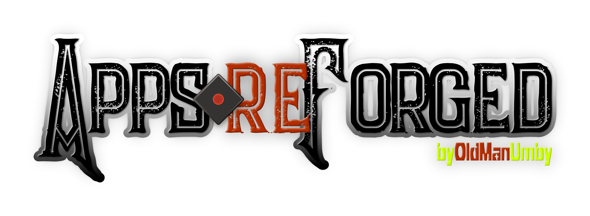

# GitWarp

A clean, client-side web application that acts as an interactive version of a GitHub URL-Swap. Users can paste a GitHub repository URL, and the app will dynamically generate a grid of cards providing "swapped" URLs that unlock different superpowers for that repository.

Based on the [Hyperautomation Labs Cheat Sheet](https://hyperautomationlabs.co)

## Features

- **26 Interactive Swaps:** Generate URLs for services like gitingest, github.dev, bolt.new, gitmcp, and more with one click.
- **Context-Aware Engine:** Paste any GitHub URL (User, Repo, File, Commit, PR). The app automatically parses the context and highlights only the tools that are compatible with your URL.
- **Advanced Interactive Tools:**
  - **Deep Linker:** Target precise code line ranges (L10-L20) and toggle raw views.
  - **Time Machine Compare:** Quickly generate comparison diffs across branches, tags, or relative timeframes (e.g., `1.month.ago`).
  - **Commit Feed Filter:** View commits tailored to specific authors, branches, and file paths.
- **Copy to Clipboard:** Quickly copy the generated URLs to your clipboard.
- **Responsive Design:** A beautiful, glassmorphism-inspired UI that works perfectly on desktop and mobile devices.

## Setup & Installation

This project is built using vanilla JavaScript and Vite.

**1. Clone the repository and navigate into it:**

```bash
cd APP-GitWarp
```

**2. Install dependencies:**

```bash
npm install
```

**3. Run the development server:**

```bash
npm run dev
```

**4. Build for production:**

```bash
npm run build
```

## License

This project is open-source and available under the MIT License.
