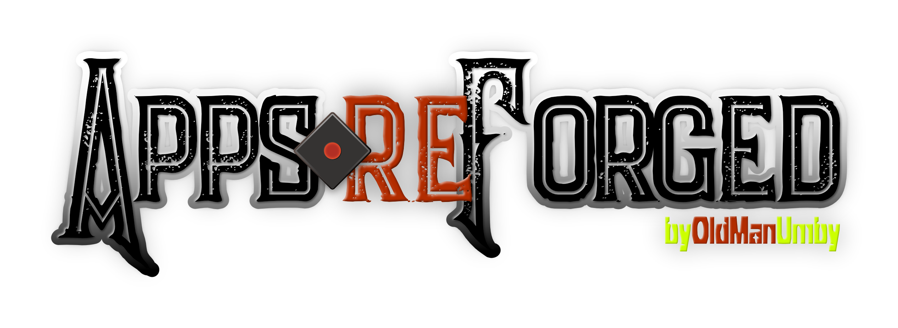

# GitWarp

A clean, client-side web application that acts as an interactive version of a GitHub URL-Swap. Users can paste a GitHub repository URL, and the app will dynamically generate a grid of cards providing "swapped" URLs that unlock different superpowers for that repository.

Based on the [Hyperautomation Labs Cheat Sheet](https://hyperautomationlabs.co)

## Features

- **27 Interactive Swaps:** Generate URLs for services like gitingest, github.dev, bolt.new, gitmcp, gitreverse, and more with one click.
- **Context-Aware Engine:** Paste any GitHub URL (User, Repo, File, Commit, PR). The app automatically parses the context and highlights only the tools that are compatible with your URL.
- **Advanced Interactive Tools:**
  - **Deep Linker:** Target precise code line ranges (L10-L20) and toggle raw views.
  - **Time Machine Compare:** Quickly generate comparison diffs across branches, tags, or relative timeframes (e.g., `1.month.ago`).
  - **Commit Feed Filter:** View commits tailored to specific authors, branches, and file paths.
- **Go! or Copy:** Instantly open the generated URLs in a new tab with the "Go!" button, or copy them directly to your clipboard.
- **Responsive Design:** A beautiful, glassmorphism-inspired UI that works perfectly on desktop and mobile devices.

## Setup & Installation

This project is built using a modern **Bun (Rust)** Monorepo architecture and is deployed globally via **Cloudflare Pages**. It utilizes strict local defensive tooling (Husky, Fallow, ESLint, Secretlint) to enforce code quality before pushing.

**1. Clone the repository and navigate into it:**

```bash
git clone https://github.com/oldmanumby/gitwarp.git
cd gitwarp
```

**2. Install dependencies (using Bun):**

```bash
bun install
```

**3. Run the development server:**
The frontend app is located in the `apps/gitwarp` workspace.

```bash
cd apps/gitwarp
bun run dev
```

**4. Build for production:**

```bash
cd apps/gitwarp
bun run build
```

## Developer Workflow

- **Commit & Push:** Always commit using conventional commits (e.g., `feat:`, `fix:`). The local pre-commit hooks will automatically lint and check for dead code/secrets.
- **Syncing Branches:** This repo uses GitHub Actions and **Release Please** to automate semantic versioning on the `main` branch. If you are developing on a `dev` branch, you can instantly pull down the latest `main` releases by running:
  ```bash
  bun run sync
  ```

## License

This project is open-source and available under the MIT License.
